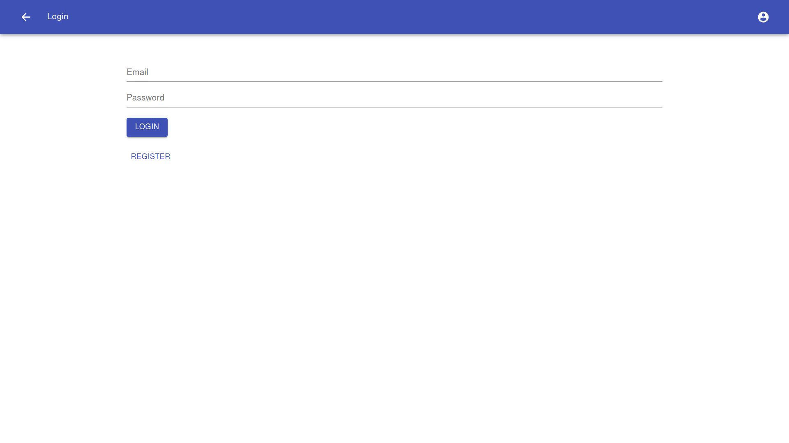
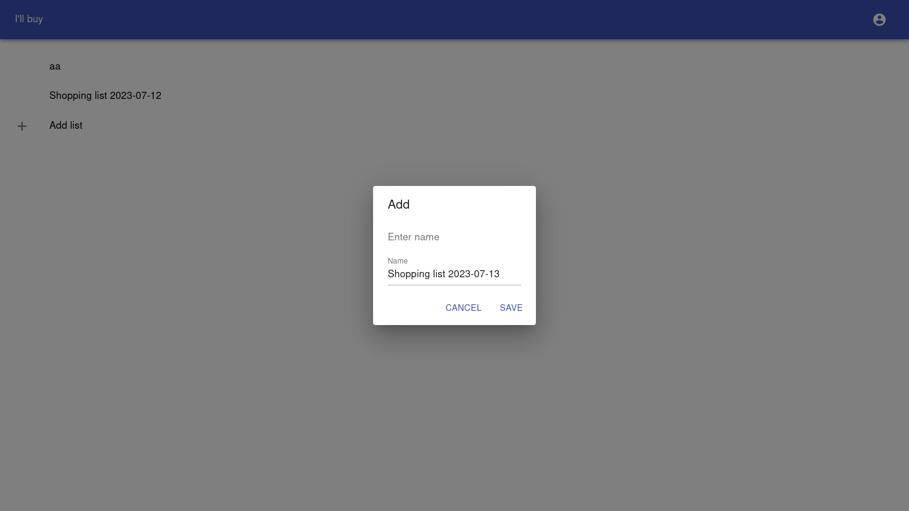
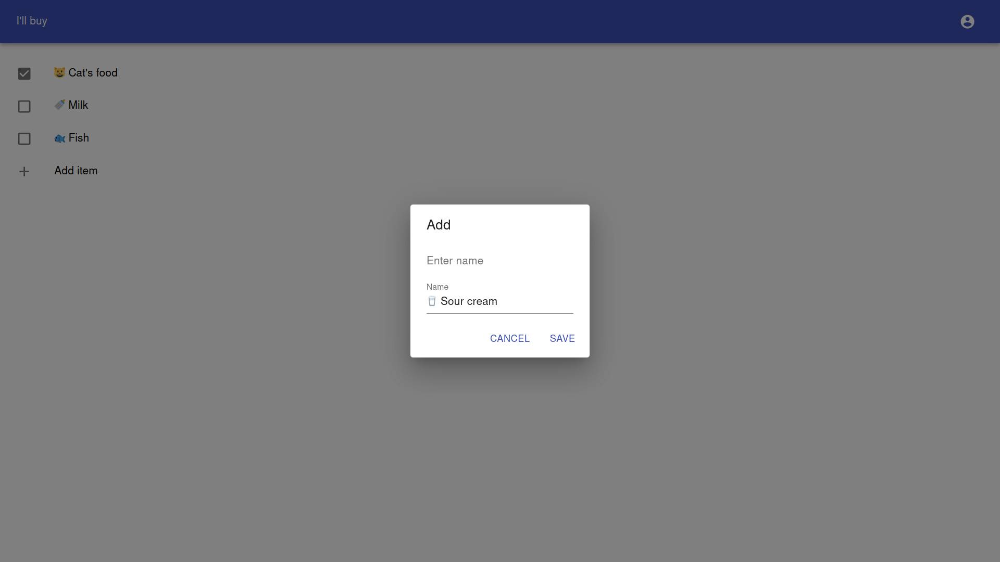

#  I'll buy

Is an open source tool for creating lists.


Backend running with Django.
Frontend using React.

# Running 
## Backend
```bash
# install the dependencies
pip install -r  requirements.txt
# prepare database
python manage.py makemigrations
python manage.py migrate
# run
python manage.py runserver
```

## Frontend
all frontend code is located in `static/` directory
```bash
# go to `static/` directory
cd static/
# install the dependencies
npm i
# run
NODE_OPTIONS=--openssl-legacy-provider npm run-script start
```

# Screenshots 




# Future steps 
- [ ] ~~rewrite in rust~~ (no, due to [russian goverment ban hrt](https://meduza.io/en/feature/2023/06/12/they-re-taking-our-futures-away))

